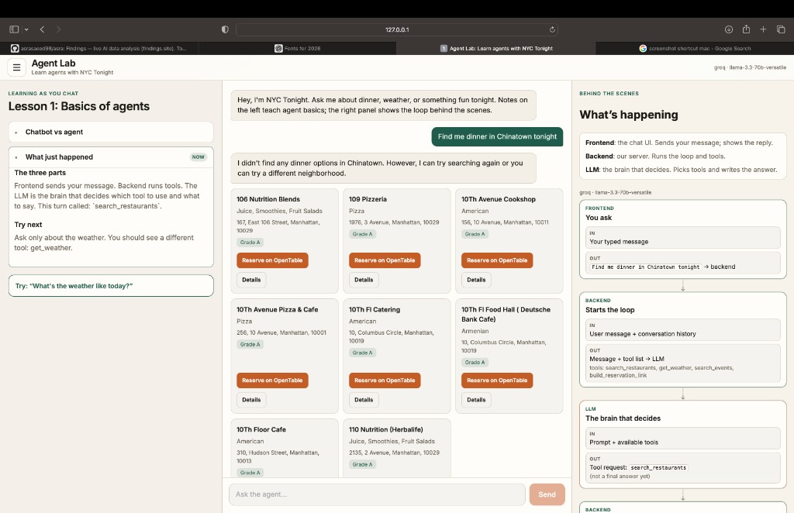

# Agent Lab — learn agents with NYC Tonight

Interactive lab for learning how **AI agents** work. Chat with a small NYC
concierge agent; Lesson 1 notes explain the basics as you go; a “What’s happening”
panel shows the tool-use loop (frontend → backend → LLM → tools → reply).

Clone and run locally — **free by default** (Groq free tier or Ollama; public data APIs + fixtures).

> A chatbot only talks. An agent can use **tools** (real APIs / code), read the
> results, and then answer.



## Architecture

```
Frontend (React + Vite)
  notes | chat | what’s happening
           │
           └─ POST /chat ──► Backend (FastAPI)
                               └─ tool-use loop (Groq or Ollama)
                                  ├─ search_restaurants  → NYC Open Data (or fixtures)
                                  ├─ get_weather         → Open-Meteo (or sample)
                                  ├─ search_events       → Ticketmaster or fixtures
                                  └─ build_reservation_link → OpenTable/Resy URL
```

Every `/chat` response includes `{ reply_text, results, trace }`. Teaching copy is
deterministic (driven by `trace`), not a second LLM call.

The backend also **scopes tools to the current message** (e.g. weather-only asks
only expose `get_weather`) so chat history cannot pull in unrelated tools.

**Reservations are deep-link handoff only.** We never automate bookings.

## Project layout

```
nyc-tonight/
├── docs/
│   └── agent-lab.png        # README screenshot
├── backend/
│   ├── main.py              # POST /chat, GET /health
│   ├── agent_loop.py        # tool-use loop + trace
│   ├── providers.py         # Groq / Ollama / optional Anthropic
│   ├── tools.py             # tool schemas + executors
│   ├── fixtures/            # sample restaurants + events
│   ├── check_setup.py       # optional local sanity check
│   ├── requirements.txt
│   ├── Procfile             # Railway
│   └── .env.example
└── frontend/
    ├── src/App.jsx          # shell: header, menu, three panes
    ├── src/LessonNotes.jsx  # Lesson 1 accordion
    ├── src/TracePanel.jsx   # What’s happening flow
    ├── src/lessons.js       # lesson copy + step logic
    ├── src/ResultCard.jsx
    └── .env.example         # VITE_API_URL for deploy
```

## Quick start

### 1. LLM (pick one)

**Groq (easiest):** get a free key at [console.groq.com](https://console.groq.com).

**Ollama (fully local):** install from [ollama.com](https://ollama.com), then:

```bash
ollama pull qwen2.5:7b
```

### 2. Backend (port 8000)

```bash
cd nyc-tonight/backend
python3 -m venv .venv
source .venv/bin/activate          # Windows: .venv\Scripts\activate
pip install -r requirements.txt
cp .env.example .env
# Edit .env: set GROQ_API_KEY=...  (or use Ollama with no key)
python check_setup.py                 # optional sanity check
uvicorn main:app --reload --port 8000
```

Health check:

```bash
curl -s http://127.0.0.1:8000/health | python3 -m json.tool
```

You should see `"provider": "groq"` (or `"ollama"`) and tool source info.

### 3. Frontend (port 5173)

```bash
cd nyc-tonight/frontend
npm install
npm run dev
```

Open the URL Vite prints (usually http://127.0.0.1:5173).

## Environment variables

Put secrets only in `backend/.env` (gitignored). Never commit real keys.

| Var | Required? | Purpose |
|-----|-----------|---------|
| `GROQ_API_KEY` | No* | Free cloud LLM with tool calling |
| `LLM_PROVIDER` | No | Force `groq`, `ollama`, or `anthropic` |
| `OLLAMA_BASE_URL` | No | Default `http://127.0.0.1:11434/v1` |
| `OLLAMA_MODEL` | No | Default `qwen2.5:7b` |
| `GROQ_MODEL` | No | Default `llama-3.3-70b-versatile` |
| `TICKETMASTER_API_KEY` | No | Live events; else fixture events |
| `NYC_OPENDATA_APP_TOKEN` | No | Higher NYC Open Data rate limits |
| `CORS_ORIGINS` | No | Default `*` for local |
| `VITE_API_URL` | No | Frontend → API URL (defaults to `http://127.0.0.1:8000`) |

\* One of Groq or Ollama should be available for the agent to think.

Restaurants (NYC Open Data) and weather (Open-Meteo) need **no keys**. If those
APIs are unreachable, the backend falls back to local fixtures so Lesson 1 still works.

## Lesson 1

1. Notes introduce chatbot vs agent; try the dinner prompt.
2. After tools run, notes explain frontend / backend / LLM and the loop.
3. Second prompt: weather only, so you see a different tool (`get_weather`).
4. Recap. Lessons 2–3 are listed in the hamburger as coming soon.

Left notes keep earlier sections (collapsed, expandable). What’s happening stays
blank until you send a message, then shows the In/Out flow for that turn.

## Deploy (optional)

- **Backend** → Railway, root directory `nyc-tonight/backend` (see `Procfile`).
- **Frontend** → Vercel, root directory `nyc-tonight/frontend`.
- Set `GROQ_API_KEY`, `CORS_ORIGINS=https://your-app.vercel.app`, and
  `VITE_API_URL=https://your-api.up.railway.app` on the hosts.

## Guardrails

- No browser automation against OpenTable/Resy.
- No database or auth; conversation state lives in the browser session.
- Teaching notes are deterministic copy driven by `trace`.
